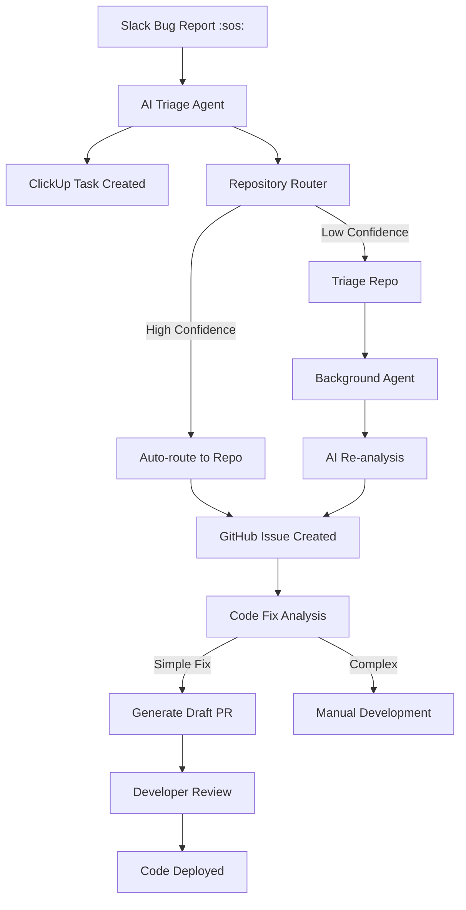

# 🤖 AI-Powered Bug Router System

> **Automated Slack → ClickUp → GitHub → Code Fix Pipeline**

This system provides an end-to-end automated bug reporting and resolution pipeline that:
1. 📱 **Captures** bug reports from Slack 
2. 🧠 **Analyzes** them with AI for intelligent triage
3. 🎯 **Routes** them to the correct GitHub repositories 
4. 🔧 **Generates** automated code fixes when possible
5. 👥 **Notifies** development teams with context and suggestions

## 🌟 Key Features

### 🚀 **Intelligent Automation**
- **AI-Powered Triage**: GPT-4 analyzes bug reports and extracts structured information
- **Smart Repository Routing**: Multi-strategy routing using keywords, semantic analysis, and confidence scoring
- **Automated Code Fixes**: AI generates and creates draft PRs for simple issues
- **Cross-Platform Sync**: Seamless integration between Slack, ClickUp, and GitHub

### 🎯 **Advanced Routing**
- **Confidence-Based Decisions**: Only auto-route when confidence > 70%
- **Fallback to Triage**: Uncertain issues go to a triage repo for human review
- **Repository Registry**: Customizable keyword mappings for your codebase
- **Background Agents**: Continuous monitoring and re-routing every 5 minutes

### 🔧 **Code Fix Generation**
- **Risk Assessment**: Only suggests fixes for low-risk, simple issues
- **Draft PRs**: Creates draft pull requests with AI-generated code changes
- **Developer Notifications**: Detailed analysis and testing notes for human review
- **Safety First**: All fixes require human approval before merging

## 🏗️ Architecture Overview



## 🚦 Getting Started

### 1. Prerequisites
- Google Cloud Project with Cloud Functions enabled
- GitHub organization with repositories
- ClickUp workspace with API access
- Slack workspace with bot permissions
- OpenAI API key

### 2. Setup Steps

#### **Step 1: Clone and Configure**
```bash
git clone <your-repo>
cd bug-report-pipeline

# Update configuration
# Replace 'your-github-org' with your actual GitHub organization in:
# - scripts/bug-router-agent.js
# - scripts/code-fix-generator.js  
# - scripts/setup-repos.js
# - bug-report-pipeline/index.js
```

#### **Step 2: GitHub Repository Setup**
```bash
export GITHUB_TOKEN="your_github_token"
cd scripts
npm install
node setup-repos.js
```

#### **Step 3: Google Cloud Secrets**
```bash
# Create secrets in Google Secret Manager
gcloud secrets create GITHUB_TOKEN --data-file=<(echo "your_github_token")
gcloud secrets create OPENAI_API_KEY --data-file=<(echo "your_openai_key")
gcloud secrets create CLICKUP_TOKEN --data-file=<(echo "your_clickup_token")
gcloud secrets create CLICKUP_LIST_ID --data-file=<(echo "your_list_id")
gcloud secrets create SLACK_BOT_TOKEN --data-file=<(echo "your_slack_token")
```

#### **Step 4: Deploy Cloud Function**
```bash
cd bug-report-pipeline
npm install
gcloud functions deploy bugReportPipeline \
  --runtime nodejs20 \
  --trigger-http \
  --allow-unauthenticated \
  --source=. \
  --project=your-project \
  --gen2 \
  --region=us-central1
```

#### **Step 5: Configure GitHub Actions**
Add these secrets to your GitHub repository:
- `GITHUB_TOKEN`
- `OPENAI_API_KEY` 
- `CLICKUP_TOKEN`
- `CLICKUP_LIST_ID`
- `SLACK_BOT_TOKEN`

### 3. Repository Registry Configuration

Customize the repository routing in `bug-report-pipeline/index.js`:

```javascript
const REPO_REGISTRY = {
  'your-frontend': ['ui', 'react', 'web', 'frontend', 'login', 'dashboard'],
  'your-backend': ['api', 'server', 'database', 'auth', 'payment'],
  'your-mobile': ['android', 'ios', 'mobile', 'app'],
  'your-docs': ['docs', 'readme', 'guide', 'documentation']
};
```

## 🎮 How to Use

### Creating Bug Reports
1. **In Slack**: React with `:sos:` to any message describing a bug
2. **Automatic Processing**: The system will:
   - Extract and analyze the bug details with AI
   - Create a ClickUp task with structured information
   - Create a GitHub issue in the appropriate repository
   - Send a confirmation with links to both

### Monitoring and Management
- **ClickUp**: Track progress and assign team members
- **GitHub**: Review issues, PRs, and technical discussions
- **Triage Repo**: Check issues that need manual routing
- **GitHub Actions**: Monitor automated routing and fixes

### Code Fix Review Process
1. **AI Analysis**: System identifies potentially auto-fixable issues
2. **Draft PR Creation**: Creates draft PRs with suggested fixes
3. **Human Review**: Developers review, test, and approve changes
4. **Deployment**: Standard code review and deployment process

## 🔍 Monitoring and Troubleshooting

### GitHub Actions Logs
Monitor the automated agents:
- Go to **Actions** tab in your GitHub repository
- Check **AI Bug Router Agent** workflow runs
- Review logs for routing decisions and issues

### Cloud Function Logs
```bash
gcloud functions logs read bugReportPipeline --project=your-project
```

### Common Issues

#### **Issues Not Being Routed**
- Check confidence scores in GitHub Actions logs
- Update repository registry keywords
- Review AI analysis results
- Manually route from triage repository

#### **Code Fixes Not Generated**
- Verify OpenAI API key and quotas
- Check issue complexity and risk assessment
- Review GitHub permissions for PR creation
- Monitor rate limits

#### **Slack Integration Issues**
- Verify bot token permissions
- Check Slack Events API configuration
- Review Cloud Function logs for API errors

## 🎛️ Configuration Options

### Confidence Thresholds
Adjust routing confidence in `scripts/bug-router-agent.js`:
```javascript
if (!topChoice || topChoice.confidence < 0.7) {
  // Increase to 0.8 for stricter routing
  // Decrease to 0.6 for more liberal routing
}
```

### Auto-Fix Risk Levels
Configure fix generation in `scripts/code-fix-generator.js`:
```javascript
if (analysis.risk_assessment === 'high' || analysis.complexity === 'complex') {
  // Adjust risk tolerance
  // Add/remove complexity levels
}
```

### Routing Frequency
Modify GitHub Action schedule in `.github/workflows/bug-router.yml`:
```yaml
schedule:
  - cron: "*/5 * * * *"  # Every 5 minutes
  # Change to "0 */1 * * *" for hourly
  # Change to "*/10 * * * *" for every 10 minutes
```

## 📊 Analytics and Metrics

### Track Performance
- **Routing Accuracy**: Monitor manual re-routing frequency
- **Fix Success Rate**: Track accepted vs rejected auto-fixes
- **Response Time**: Measure time from Slack to resolution
- **Developer Satisfaction**: Survey team on automation helpfulness

### Continuous Improvement
- **Update Keywords**: Add new terms to repository registry
- **Refine Prompts**: Improve AI analysis accuracy
- **Expand Fix Types**: Add support for more issue categories
- **Custom Routing**: Add project-specific routing logic

## 🚀 Advanced Features

### Custom Routing Logic
Add specialized routing rules:
```javascript
// In routeToRepository function
if (keywords.includes('payment') && keywords.includes('stripe')) {
  return { repo: 'payment-service', confidence: 0.95 };
}
```

### Integration Extensions
- **Jira Integration**: Sync with Jira projects
- **Teams Integration**: Add Microsoft Teams support  
- **Custom Webhooks**: Integrate with other tools
- **Metrics Dashboard**: Build analytics dashboard

### AI Model Customization
- **Fine-tuning**: Train models on your specific codebase
- **Multiple Models**: Use different models for different tasks
- **Prompt Engineering**: Optimize prompts for your domain
- **Confidence Calibration**: Adjust confidence thresholds

## 🤝 Contributing

1. Fork the repository
2. Create a feature branch
3. Add tests for new functionality
4. Submit a pull request with detailed description

### Development Setup
```bash
npm install
npm run test
npm run lint
```

## 📜 License

MIT License - See LICENSE file for details

## 🆘 Support

- **GitHub Issues**: Report bugs and feature requests
- **Documentation**: Check the docs/ directory
- **Community**: Join discussions in GitHub Discussions
- **Enterprise Support**: Contact for custom implementations

---

**🎉 Ready to revolutionize your bug reporting workflow?** Follow the setup guide and watch as AI transforms how your team handles issues!
